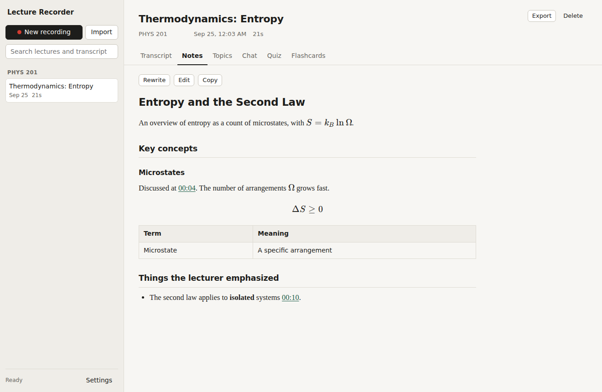
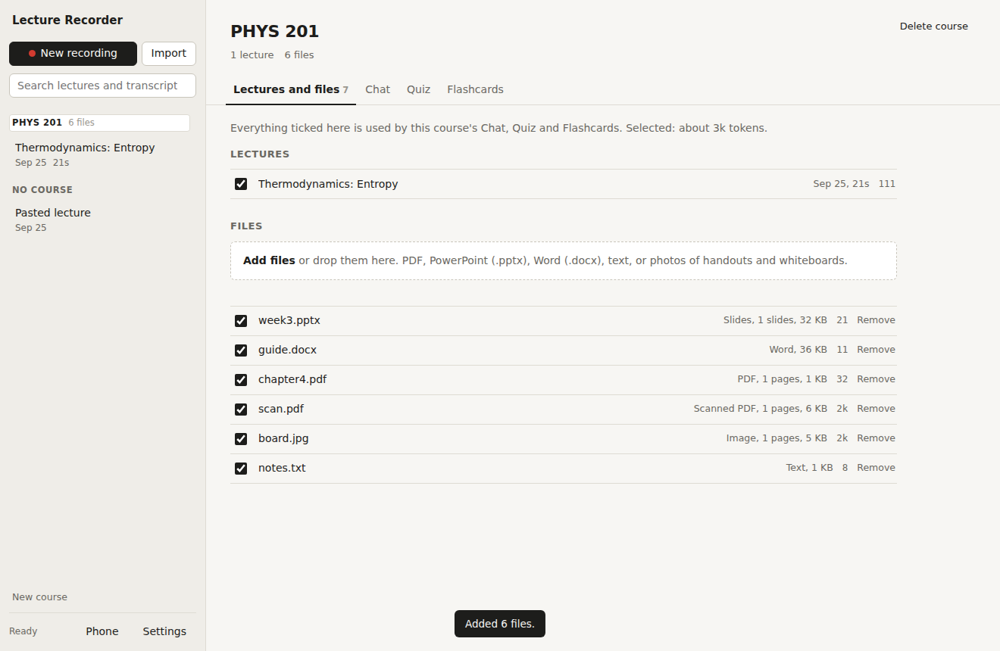
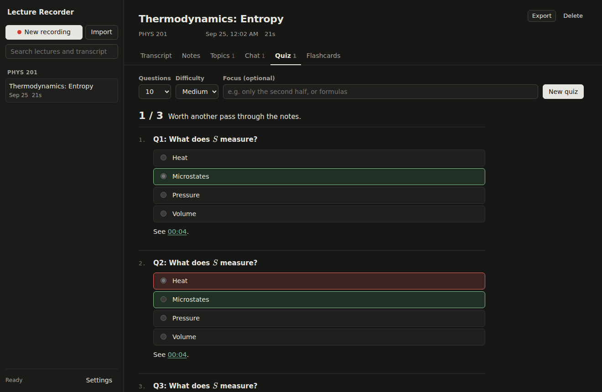

# Lecture Recorder

A desktop app for recording lectures and studying them afterwards.

- **Record** from any microphone. The transcript fills in while you record, and speech-to-text runs on your own computer with [faster-whisper](https://github.com/SYSTRAN/faster-whisper). Your audio never leaves the machine.
- **Notes** are written automatically when you press Stop: overview, key concepts, definitions, what the lecturer emphasized, deadlines and open questions. You can edit them.
- **Chat** with the lecture. Answers are based on the transcript, cite timestamps, and say when they go beyond what was covered.
- **Topics**: get a list of what the lecture covered, then open a deep dive on any topic, or on anything you type in.
- **Quiz**: multiple choice, or written answers that Claude grades with feedback and a model answer. Easy, medium or hard, with an optional focus. Past scores are kept.
- **Flashcards**: a generated deck with flip, "again" and "got it", plus keyboard shortcuts.
- **Courses**: group lectures into a course, add the course's files (PDF, PowerPoint, Word, text, or photos of handouts and whiteboards), and use Chat, Quiz and Flashcards across all of them at once. Tick or untick which lectures and files to include.
- **Phone**: pair your iPhone (or Android) with a QR code and record and study from it over Wi-Fi, while the computer does the transcription. It installs to the home screen like an app.
- **Import** an existing audio or video file, or paste a transcript.
- Timestamps anywhere in the app (notes, chat, quiz explanations) play the recording from that moment.
- Search across all lectures and transcripts, export a lecture to Markdown. Math renders properly. Light and dark themes follow your system.





## Download

Get the installer from the [latest build](https://github.com/antonkozlov07/lecturerecorder/releases/tag/latest). No Python needed.

**Windows:** run **LectureRecorder-Setup.exe**. It installs for your user only (no administrator rights) and adds Lecture Recorder to the Start menu. Windows may show "Windows protected your PC" because the installer isn't code-signed: click **More info**, then **Run anyway**.

**Mac (Apple Silicon):** open **LectureRecorder-Mac.dmg** and drag Lecture Recorder into Applications. The first time you open it, macOS blocks it because it isn't notarized by Apple: open **System Settings > Privacy & Security**, scroll down and click **Open Anyway**.

You also need Microsoft Edge or Google Chrome (the app opens in one as its own window; on a Mac without either it opens in Safari) and an [Anthropic API key](https://console.anthropic.com/) for the AI features. The speech model downloads the first time the app starts (about 460 MB for the default "small" model).

Both installers are built by GitHub Actions (`.github/workflows/build.yml`) on every push, and each build is self-tested before it is published. To build on your own machine: `pip install . pyinstaller`, then `pyinstaller packaging/lecturerecorder.spec`. On Windows, compile `packaging/installer.iss` with [Inno Setup](https://jrsoftware.org/isinfo.php) to get the installer.

## Using it on your phone

1. On the computer, click **Phone** at the bottom of the sidebar and tick **Let paired phones connect over Wi-Fi**. If Windows asks whether to allow Lecture Recorder on the network, allow it on private networks.
2. Scan the QR code with the iPhone camera and follow the steps it opens. The first time, the phone installs and trusts a certificate that this computer created. Browsers only allow the microphone on secure pages, and this certificate is what makes the connection secure.
3. Open the app, then tap **Share > Add to Home Screen**.

Things to know:

- The computer must be on with the app running, and the phone on the same Wi-Fi. School or public Wi-Fi often blocks devices from reaching each other; a phone hotspot or home network works.
- iPhone stops recording in a web app when the screen locks or you switch apps. Keep the screen on during a lecture. For long lectures you can also record with Voice Memos, save the recording to Files, and use **Import**.
- Only paired devices can connect. Remove a device from the Phone window on the computer to cut it off.

## Run from source

### Requirements

- Python 3.10 or newer ([python.org](https://www.python.org/downloads/); on Windows, tick "Add Python to PATH")
- An [Anthropic API key](https://console.anthropic.com/) for notes, chat, topics, quizzes and flashcards. Recording and transcription work without one.
- Google Chrome, Microsoft Edge, Chromium or Brave. The app opens in one of these as its own window. Without one it opens in your default browser.

### Run it

**Windows:** double-click `run.bat`.

**macOS / Linux:** run `./run.sh`.

The first launch creates a virtual environment and installs dependencies, which takes a few minutes. The first recording also downloads the speech model (about 460 MB for the default "small" model). After that, startup takes a few seconds.

The app asks for your API key the first time it opens. You can change it, the Claude model, the speech model and more under **Settings**.

To run it by hand:

```sh
python -m venv .venv
.venv/bin/pip install -e .            # Windows: .venv\Scripts\pip install -e .
.venv/bin/python -m lecturerecorder   # options: --port 8765, --browser, --no-window
```

## Tips

- **Speech model:** "small" suits most laptops. "medium" or "large-v3" are more accurate and much faster with an NVIDIA GPU. "base" or "tiny" help on slow machines.
- **Language:** auto-detect works well. Set a language code (for example `en`) if a lecture mixes languages or is detected wrongly.
- **Placement:** sit close to the speaker, or use an external microphone. Transcription quality drives everything else.
- **Closing the window** quits the app. If you close it mid-recording, everything captured up to the last chunk (30 seconds by default) is kept.

## Where your data lives

Everything is stored in one folder: the database, audio, course files, settings (including your API key), the phone certificates and the app window's browser profile.

| OS | Folder |
|---|---|
| Windows | `%APPDATA%\LectureRecorder` |
| macOS | `~/Library/Application Support/LectureRecorder` |
| Linux | `~/.local/share/lecturerecorder` |

Set `LECTURERECORDER_HOME` to use a different folder. Transcripts are sent to the Anthropic API only when you use an AI feature. The local server accepts connections only from this computer.

## How it works

- `lecturerecorder/__main__.py` starts a local FastAPI server on `127.0.0.1` and opens the app window. The speech model starts loading immediately so the first recording isn't kept waiting.
- `phone.py` optionally serves the same app on the local network over HTTPS, with a certificate authority created on first use and per-device pairing tokens.
- `materials.py` extracts text from course files (pypdf, python-pptx, python-docx). Scanned PDFs and photos are sent to Claude as the original file, since it reads pages and images directly.
- The browser records audio in chunks (30 s by default) and uploads each one. `transcriber.py` transcribes them in order on a background thread, passing the end of the previous chunk as context so sentences carry across chunks.
- `ai.py` calls Claude through the official `anthropic` SDK. Every feature shares one system prompt containing the transcript with a cache breakpoint, so follow-up questions on the same lecture reuse the cached transcript. Quizzes, topics and flashcards use structured JSON output. With Claude Opus 5, requests that a safety classifier declines are automatically retried on a fallback model (`fallbacks: "default"`).
- The UI is plain HTML, CSS and JavaScript in `lecturerecorder/static/` with no build step. Markdown, sanitizing and math come from vendored copies of marked, DOMPurify and KaTeX.
